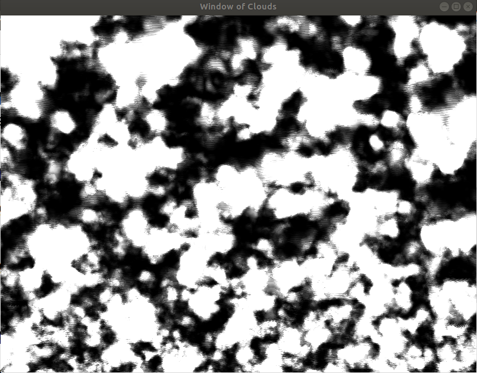
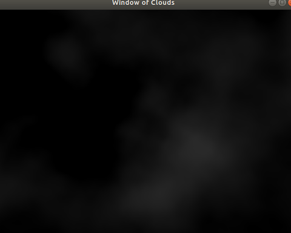
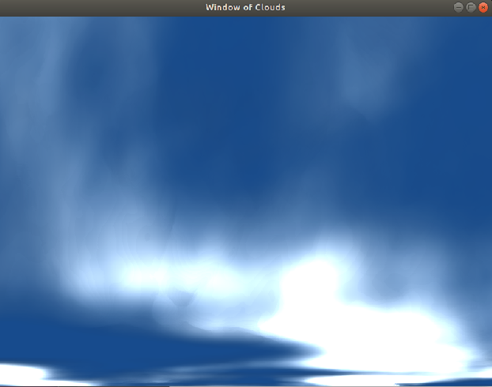
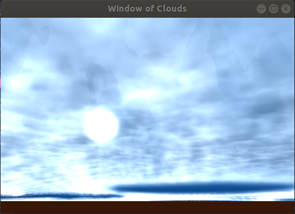
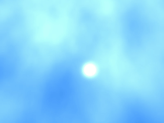
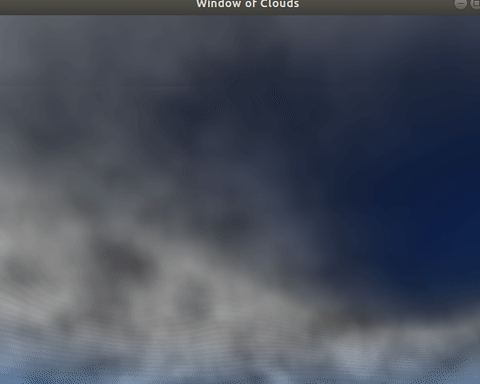

# Real-Time Volumetric Cloudscapes

Implement the method by Andrew Schneider in GPU pro 7 (2016)

## Requirements:

* OpenGL 3.4.4
* C++ 11

## Advances

* Generate base of cloud

* Shape of clouds in dark sky

* Light Clouds

* Light absortion Modeling

* Sun model

* Rainy Clouds over time

